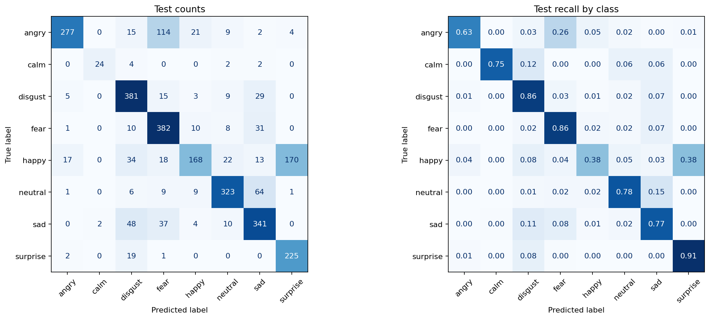

# Speech Emotion Recognition with Whisper Large V3

An eight-class speech emotion recognition project built with a frozen **Whisper Large V3 audio encoder** and a supervised neural classifier. It combines RAVDESS, CREMA-D, TESS, and SAVEE in an **OSEMN** workflow, with speaker-separated evaluation and an offline model export.

The saved Kaggle run achieved **73.09% test accuracy** on **2,902 held-out recordings**, exceeding the project's 70% target on this split. The result measures performance on held-out speakers from the included corpora; it does not establish accuracy on spontaneous speech or new recording environments.

## Results

Results below come from [`evaluation.json`](evaluation.json) and the executed [`notebook`](speech-emotion-recognition.ipynb).

| Metric | Saved run |
|---|---:|
| Test accuracy | **73.09%** — 2,121 / 2,902 correct |
| Balanced accuracy / mean class recall | 74.34% |
| Macro F1 | 73.41% |
| Weighted F1 | 72.27% |
| Equal-source mean accuracy | 74.35% |
| Selected head | MLP, checkpoint from epoch 12 |
| Selected-head validation accuracy | 77.66% |
| Offline export check | Passed in a fresh process |

### Performance by dataset

| Dataset | Test recordings | Accuracy | Macro F1 on present classes |
|---|---:|---:|---:|
| RAVDESS | 240 | 77.50% | 76.54% |
| CREMA-D | 1,142 | 75.39% | 75.57% |
| TESS | 1,400 | 70.36% | 64.40% |
| SAVEE | 120 | 74.17% | 74.40% |



**Main remaining errors:** 170 of 442 happy recordings were predicted as surprise, and 114 of 442 angry recordings were predicted as fear. Happy recall is **38.01%**, despite the overall accuracy exceeding 70%. Surprise recall is high at 91.09%, but its precision is only 56.25%. The full class report is included in the evaluation file.

## Emotion labels and data

```text
angry · calm · disgust · fear · happy · neutral · sad · surprise
```

- **RAVDESS:** eight expressions, including calm.
- **CREMA-D:** six filename expression labels; these describe the intended emotion rather than necessarily the listener-rated emotion.
- **TESS:** seven expressions; pleasant surprise (`ps`) is mapped to `surprise`.
- **SAVEE:** seven expressions.

Calm remains separate from neutral and occurs only in RAVDESS. The model therefore needs to be assessed for possible dataset-specific shortcuts. Source names, speaker IDs, and filenames are used for auditing and splitting, never as classifier inputs.

### Data audit and split

The saved audit accepted **12,154 recordings**, removed **1,441 duplicate audio entries**, quarantined **6 entries with conflicting labels**, and rejected **1 audio entry**. Duplicate counts reflect the attached dataset layout, which can include repeated copies.

| Dataset | Training | Validation | Test |
|---|---:|---:|---:|
| RAVDESS | 960 | 239 | 240 |
| CREMA-D | 5,148 | 1,145 | 1,142 |
| TESS | 1,400 | 0 | 1,400 |
| SAVEE | 240 | 120 | 120 |
| **Total** | **7,748** | **1,504** | **2,902** |

All recordings of a source-qualified speaker stay in one partition. The split contains 82 training, 19 validation, and 20 test speaker IDs. Exact decoded-audio hashes are checked for overlap.

**TESS exception:** it has only two speakers, so one is assigned to training and one to test. There is no TESS validation speaker. This avoids speaker overlap but leaves model selection and calibration without direct TESS validation coverage.

The parser explicitly handles the archive irregularities `1040_ITH_SAD_X.wav` in CREMA-D and `OAF_neutral/OA_bite_neutral.wav` in TESS. The latter belongs to speaker OAF, not an additional speaker named OA.

## Method: OSEMN

| Stage | Implementation |
|---|---|
| **Obtain** | Load the four Kaggle sources and parse their labels and speaker identities. |
| **Scrub** | Validate audio, resample consistently, preserve useful speech, audit duplicates, and separate speakers. |
| **Explore** | Inspect development class counts, source imbalance, durations, clipping, and waveforms. |
| **Model** | Extract frozen Whisper representations and compare linear and MLP emotion heads. |
| **iNterpret** | Evaluate fixed model settings on test speakers, report per-source errors, and verify export. |

### Audio preprocessing

1. Decode audio and convert to mono, with a check for stereo phase cancellation.
2. Resample to **16 kHz** with a high-quality resampler and remove DC offset.
3. Reject nonfinite, silent, unreadable, or unsupported-length recordings. Clipping is flagged rather than automatically discarded.
4. Trim boundary silence with a **150 ms margin**, retaining internal pauses.
5. Process the complete recording in windows of at most **30 seconds**; do not discard a fixed opening offset or truncate every recording to 2.5 seconds.
6. Apply Whisper's own **128-bin log-mel frontend**, with waveform normalization disabled.

Right-padding positions are excluded from feature pooling after accounting for the encoder's convolution stride. This does **not** mask padding inside Whisper's attention mechanism. No pitch shifting, time stretching, aggressive denoising, or synthetic oversampling is used in this run.

### Encoder and classification head

```text
Audio → shared preprocessing → frozen Whisper Large V3 encoder
      → mean + standard deviation + four ordered quarter contrasts
      → 7,680 features → training-fitted normalization → emotion head
      → temperature scaling → eight emotion probabilities
```

- **Backbone:** [`openai/whisper-large-v3`](https://huggingface.co/openai/whisper-large-v3), 32 encoder layers and hidden width 1,280.
- **Pinned revision:** `06f233fe06e710322aca913c1bc4249a0d71fce1`.
- **Selected MLP:** 7,680 → 256 → 128 → 8, with LayerNorm, GELU, and dropout.
- **Training:** AdamW, learning rate `3e-4`, weight decay `0.01`, class weighting, label smoothing `0.05`, and gradient clipping.
- **Selection:** validation accuracy, then macro F1; maximum 60 epochs and early stopping after 10 epochs without improvement.
- **Normalization:** fitted on training features only, with a fixed ±8-standard-deviation cap.
- **Calibration:** a positive validation-fitted temperature of approximately `1.0831`, preserving the highest-scoring class.

The linear head reached 77.59% validation accuracy; the MLP reached 77.66%. This small validation difference selected the MLP but is not evidence of a large or statistically established advantage.

Whisper was pretrained for transcription, not these emotion labels. This project trains a separate emotion head on frozen audio features. It does not fine-tune the complete backbone or classify generated transcripts.

## Run on Kaggle

1. Upload [`speech-emotion-recognition.ipynb`](speech-emotion-recognition.ipynb) to Kaggle.
2. Attach the four datasets below.
3. Enable **Internet** and a **GPU**, start a fresh session, and run all cells.
4. Download the three final outputs after the export check passes.

The saved run used a **Tesla T4**. The notebook uses one GPU, starts with an encoder batch size of four, and reduces it on GPU memory exhaustion. The initial checkpoint download is several GB; full-dataset extraction may take hours. Features are cached under `/kaggle/temp` to support resuming within the same session.

Configured paths:

```python
PATHS = {
    "RAVDESS": "/kaggle/input/ravdess-emotional-speech-audio/",
    "CREMA-D": "/kaggle/input/cremad/AudioWAV/",
    "TESS": "/kaggle/input/toronto-emotional-speech-set-tess/TESS Toronto emotional speech set data/",
    "SAVEE": "/kaggle/input/surrey-audiovisual-expressed-emotion-savee/ALL/",
}
```

The installation cell pins compatible library versions, including Transformers `4.49.0`, Accelerate `1.4.0`, librosa `0.11.0`, and scikit-learn `1.6.1`. It retains Kaggle's installed CUDA/PyTorch build. The exported manifest records the actual runtime package versions and random seed (`42`).

## Files

```text
Speech Emotion Recognition/
├── README.md
├── speech-emotion-recognition.ipynb
├── evaluation.json
└── confusion_matrix.png
```

The notebook generates only three final Kaggle files:

| Output | Purpose |
|---|---|
| `whisper_ser_deployment.zip` | Evaluated model weights, frontend, normalization, inference module, metadata, requirements, and audit. |
| `evaluation.json` | Overall and per-source metrics, class report, split counts, and export-check status. |
| `confusion_matrix.png` | Test counts and class recall. |

**The deployment ZIP is not included in the current project folder.** Download it from the completed Kaggle run, or generate it by running the notebook. The saved evaluation records a successful offline export check; the archive itself was not available for inspection in this folder.

## Use the exported model

Extract `whisper_ser_deployment.zip` next to your application. Install its requirements in a dedicated environment, using the PyTorch build appropriate to your CPU or GPU:

```bash
python -m pip install -r whisper_ser_deployment/requirements.txt
```

```python
import sys

sys.path.insert(0, "whisper_ser_deployment")
from predict import EmotionPredictor

predictor = EmotionPredictor("whisper_ser_deployment", device="cpu")  # or "cuda:0"
result = predictor.predict("recording.wav")

print(result["emotion"])
print(result["confidence"])
print(result["probabilities"])
```

Command-line inference:

```bash
python whisper_ser_deployment/predict.py --bundle whisper_ser_deployment --audio recording.wav --device cpu
```

Reuse a predictor instance for multiple recordings. After the bundle and dependencies are installed, inference loads local encoder weights and requires no Hugging Face download. GPU extraction uses FP16 and CPU inference uses FP32, so small numerical differences are possible.

The bundle stores encoder and classifier weights as **Safetensors** and normalization as **NPZ**. It excludes the transcription decoder, optimizer state, alternative checkpoints, raw recordings, and large feature caches. The exported head is the exact evaluated training-speaker model; it is not retrained on test data afterward.

## Limitations and next steps

- The evaluation uses acted expressions and known corpora. New speakers, microphones, languages, spontaneous speech, and unseen domains require separate evaluation.
- Scripted sentences can recur across partitions. The split measures speaker separation, not unseen-text generalization.
- TESS has no validation speaker; calm appears only in RAVDESS. Dataset differences can become shortcuts.
- Speaker aliases across corpora and overlap with Whisper pretraining data were not independently verified. Exact hashes do not detect every altered duplicate.
- Temperature calibration reuses validation data used for model selection. Its confidence values are approximate and do not detect unknown emotions or non-speech.
- Happy/surprise and angry/fear confusion remain priorities. Future improvements should be compared on the fixed split, with a new external set reserved for deployment claims.

## References and source terms

- [Whisper Large V3 model card](https://huggingface.co/openai/whisper-large-v3)
- [Transformers Whisper implementation used by the notebook](https://github.com/huggingface/transformers/blob/v4.49.0/src/transformers/models/whisper/modeling_whisper.py)
- [RAVDESS](https://zenodo.org/records/1188976)
- [CREMA-D](https://github.com/CheyneyComputerScience/CREMA-D)
- [TESS](https://doi.org/10.5683/SP2/E8H2MF)
- [SAVEE](https://kahlan.eps.surrey.ac.uk/savee/)

No project `LICENSE` file is currently included. The source datasets, pretrained checkpoint, and dependencies retain their own terms; this README does not grant additional usage rights.
